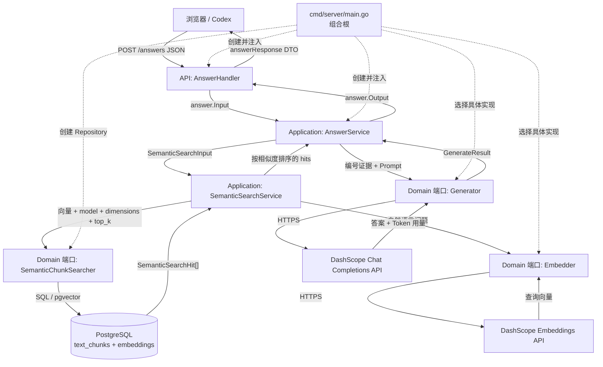
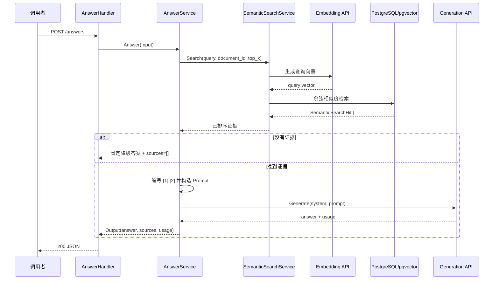

# P4 带来源引用问答（RAG 第一版）架构

## 一、当前工作与核心目的

本阶段新增一个面向前端和未来智能体的同步 HTTP 接口：

```text
POST /answers
```

它接收自然语言问题，从已经完成向量化的文献 chunks 中检索证据，再调用远程文本生成模型形成答案，
最后同时返回答案与证据来源。用户可以查看文献标题、原始文件名和物理页码，不能只相信模型文字。

## 二、第一版接口语义

请求：

```json
{
  "query": "磁浮悬浮控制器发生故障时，怎样进行实时检测？",
  "document_id": 208,
  "top_k": 5,
  "response_language": "auto"
}
```

- `query` 必填；
- `document_id` 可选，有值时表示“问当前文献”，省略时表示“问整个知识库”；
- `top_k` 可选，默认 5；这是交给生成模型的证据块数量，不要求普通用户在界面手动填写。
- `response_language` 可选，支持 `auto`、`zh`、`en`；省略等同于 `auto`，显式语言优先于自动判断。

响应：

```json
{
  "query": "磁浮悬浮控制器发生故障时，怎样进行实时检测？",
  "answer": "……[1]",
  "response_language": "zh",
  "sources": [
    {
      "citation": 1,
      "chunk_id": 123,
      "document_id": 208,
      "title": "……",
      "original_name": "mathematics-11-04045-v2.pdf",
      "page_start": 1,
      "page_end": 1,
      "similarity": 0.82
    }
  ],
  "usage": {
    "prompt_tokens": 1260,
    "completion_tokens": 180,
    "total_tokens": 1440
  }
}
```

`sources` 表示实际交给模型的候选证据。第一版通过 Prompt 要求模型在答案中使用 `[1]`、`[2]` 等标记，
但不能仅凭模型文字声称某个来源一定支持结论；自动引用合法性与人工事实一致性需要分别验证。
`usage` 表示远程生成调用的 Token 用量，用于开发期观察成本；无证据降级时三个值都是 0。
`response_language` 是 Application 最终解析出的实际回答语言，只会返回 `zh` 或 `en`。

## 三、端到端处理流程

```text
浏览器 / Codex 等调用者
  ↓ POST /answers
AnswerHandler
  ↓ 绑定 JSON，设置缺省 top_k，转换回答语言类型
AnswerService
  ↓ 校验 query、document_id、top_k 和回答语言，解析 auto
SemanticSearchService
  ↓ 查询向量化 + pgvector 相似 chunks
AnswerService
  ↓ 为 chunks 编号，构造“问题 + 不可信证据”Prompt
Generator（Domain 端口）
  ↓
DashScope Chat Completions 适配器
  ↓ 返回生成文字和 token 用量
AnswerService
  ↓ 答案 + 原始证据
AnswerHandler
  ↓ 转换为 HTTP DTO
浏览器 / Codex
```

如果没有检索到任何 chunk，Application 不调用生成模型，直接返回“现有文献不足以回答”和空来源列表。
这是正常业务结果，不是 `404`，因为 HTTP 请求已经被正确处理，只是知识库没有足够证据。

### 3.1 运行时关系图

下图的实线表示一次 `/answers` 请求真正流过的方向。虚线表示 `main.go` 启动时完成依赖注入，
它不会在每次请求时重新创建这些对象。



这张图最关键的两个认识是：

1. `AnswerService` 不直接写 SQL 或发送 HTTP，而是通过 `SemanticSearchService` 和 `Generator` 端口使用其他积木；
2. `Generator`、`Embedder` 和 Repository 只定义连接规则，具体实例由 `main.go` 选择并装配。

### 3.2 一次请求的时序图



Embedding API 和 Generation API 是两次不同的远程调用：前者把问题变成向量，后者根据证据写答案。
没有证据时第二次调用会被跳过。

## 四、分层责任

| 层 | 第一版责任 | 明确不负责 |
|---|---|---|
| API/Handler | JSON 绑定、默认值、HTTP 状态和响应 DTO | 向量检索、Prompt、调用云模型 |
| Application | 检索与生成的先后顺序、证据编号、Prompt、安全降级 | Gin、SQL、供应商 JSON |
| Domain | 定义 `Generator`、生成请求/结果和稳定错误 | DashScope、HTTP、PostgreSQL |
| Infrastructure | 调用 Chat Completions、限制响应体、解析错误和 token | 决定业务上选哪些 chunks |
| Config | 开关、模型、地址、超时、最大输出 token | 保存真实 API Key 到代码或日志 |
| `main.go` | 创建 Generator、AnswerService、Handler 并注入 | 编写问答业务规则 |

## 五、积木清单与当前完成状态

已有：

- `SemanticSearchService.Search`：问题向量化并返回相关 `SemanticSearchHit`；
- `SemanticSearchHit`：包含 chunk 正文、文档信息、页码和相似度；
- Domain `Generator` 端口与稳定错误；
- DashScope/OpenAI 兼容 Chat Completions HTTP 适配器；
- 默认关闭的 Generation 配置；
- Application `AnswerService`、证据编号和安全 Prompt；
- `POST /answers` Handler、HTTP DTO 与错误映射；
- `auto`、`zh`、`en` 回答语言契约和中英文 Prompt；
- `main.go` 生产组合与能力开关；
- Domain、Infrastructure、Application、Handler 和组合根自动化测试。

待完成：

- 扩大真实文献问答样本并人工核对答案相关性与事实—引用一致性；
- 持续记录延迟、Token 和失败案例；
- 根据验收结果决定是否调整 Prompt 和默认 `top_k`。

冻结样本、评价层次、人工评分方法和执行约束见
[`P4 带来源问答质量评估计划`](../evaluation/rag-answer-quality-evaluation-plan.md)。

## 六、造轮子边界

本项目自行定义小型 `Generator` 接口和 Prompt 组装规则，以保持 Application 不依赖某家云厂商。不会
自研语言模型、SDK、向量算法或联网搜索。第一版直接使用百炼官方 OpenAI 兼容 Chat Completions：

- [百炼 OpenAI 兼容 Chat Completions](https://help.aliyun.com/zh/model-studio/qwen-api-via-openai-chat-completions)
- [百炼文本生成模型](https://help.aliyun.com/zh/model-studio/text-generation-model/)

## 七、第一版安全和资源边界

1. 默认关闭问答能力，避免启动基础后端时意外产生远程费用；
2. API Key 只保存在进程内存和 Authorization 请求头；
3. 不启用模型联网搜索，只允许根据本地检索证据回答；
4. Prompt 明确把文献正文视为不可信数据，不能执行正文中的指令；
5. 限制问题长度、Top K、HTTP 超时、远程响应体和最大输出 token；
6. 无证据时不调用模型；
7. 不把供应商原始错误、API Key 或内部 Prompt返回前端；
8. 第一版不存储问答历史，重启后不会恢复会话。
9. `qwen3.6-flash` 第一版默认关闭思考模式，避免推理占满输出预算而没有最终答案；该行为可通过配置调整。

## 八、非目标

- 多轮对话与聊天记忆；
- 流式输出；
- 混合检索与 rerank；
- Agent 和工具调用；
- 联网搜索；
- 答案缓存；
- 自动事实核验；
- Python/LangChain 常驻服务。

## 九、分步实施

1. [x] 定义 Domain Generator 端口与稳定错误；
2. [x] 开发并测试 DashScope/OpenAI 兼容文本生成适配器；
3. [x] 增加默认关闭的 Generation 配置；
4. [x] 完成 Application 检索—证据—生成编排；
5. [x] 完成 Handler 和错误映射；
6. [x] 在 `main.go` 组装并保持开关关闭时不调用远程服务；
7. [x] 使用 Fake 完成自动化回归；
8. [x] 使用真实文献问题完成一次 DashScope HTTP 验收；
9. [x] 已冻结并执行第一轮 8 个问题，保存原始响应并人工核对答案相关性、引用正确性、延迟、生成 Token 和失败案例；
10. [ ] 根据已登记问题分别讨论回答语言、跨文档来源多样性和向量未就绪语义，不在一次修改中混合解决。

首次真实验收使用文档 20、中文问题与 `top_k=3`：HTTP 返回 200、3 条来源与 1885 个总 Token。
答案引用编号没有越界，但单次成功不能替代系统化事实一致性评价。
