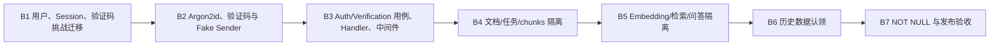

# P6 个人用户域后端交接

> 状态：实施中；B1、B2 以及 B3 验证码申请、注册、登录、Session 鉴权、当前用户和退出闭环已完成，下一步进入 B4 文档归属与基础隔离。交接日期：2026-08-16。
> 产品边界、主线图和跨端验收标准以
> [P6 个人用户域与私有数据闭环](../../shared/architecture/personal-user-domain.md) 为准；本文只冻结 Go、PostgreSQL、Worker 和测试的实施边界。

## 1. 后端交付目标

后端需要提供可信身份、持久 Session 和全链路个人数据隔离，同时保持现有 PDF、Worker、Embedding 和 RAG
核心职责不变。身份校验必须发生在 HTTP 边界，资源隔离必须继续下沉到 Application 与 Repository。

```text
Cookie
  → Auth Middleware
  → Actor{UserID, SessionID}
  → OwnerScope{OwnerUserID}
  → Application
  → Scoped Repository SQL
```

## 2. 建议包与依赖边界

```text
backend/internal/
├── domain/
│   ├── user/                 # User、状态、Repository 端口
│   └── auth/                 # Session、验证码挑战及认证相关稳定类型
├── application/
│   ├── auth/                 # 注册、登录、退出、当前身份
│   ├── verification/         # 创建和消费验证码挑战
│   └── scope/                # Actor/OwnerScope 与上下文无关的值对象
├── api/
│   ├── auth_handler.go
│   ├── auth_middleware.go
│   └── actor_context.go
└── infrastructure/
    ├── postgres/
    │   ├── user_repository.go
    │   ├── session_repository.go
    │   └── verification_repository.go
    ├── password/
    │   └── argon2id.go
    └── verification/
        ├── fake_sender.go    # 默认测试与零费用开发
        └── email_sender.go   # 独立真实验收时启用
```

遵循当前项目“接口由使用方定义、基础设施实现端口”的方式，不创建会把业务层拖入 Redis/SQL 细节的万能
`Cache` 或 `AuthManager`。

## 3. 领域与应用类型

建议最小类型：

```go
type Actor struct {
    UserID    int64
    SessionID int64
}

type OwnerScope struct {
    OwnerUserID int64
}

type User struct {
    ID          int64
    Email       *string
    PhoneE164   *string
    DisplayName string
    Status      Status
    CreatedAt   time.Time
    UpdatedAt   time.Time
}
```

用户必须至少具有一个联系方式，且对应的 `email_verified_at` 或 `phone_verified_at` 不为空。`password_hash`
不进入公开 `User`，只通过认证仓储的私有记录交给密码校验用例。Handler 不把 Gin Context 传入
Application；它只从 Context 取出 Actor，再构造普通输入值。

## 4. 数据库迁移交接

当前最新迁移为 `000009`。按两个发布门禁实施：

### Release A

- `000010_create_users_sessions_and_verifications.up.sql`：创建 `users`、`user_sessions`、
  `verification_challenges` 及索引；
- `000011_add_document_owner.up.sql`：增加暂时可空的 `documents.owner_user_id`、外键和
  `(owner_user_id, created_at DESC, id DESC)` 索引；
- 应用查询对 `owner_user_id IS NULL` 默认拒绝访问；
- 增加一次性 `cmd/assign-document-owner`，只接受明确的用户 ID，事务内认领空归属文档，输出更新数量，
  不打印邮箱、文件名或正文。

### Release B

- 运行只读检查：`SELECT COUNT(*) FROM documents WHERE owner_user_id IS NULL` 必须为 0；
- `000012_require_document_owner.up.sql` 将字段改为 `NOT NULL`；
- 删除仅为迁移期存在的兼容分支。

`users.email` 入库前统一 `strings.ToLower(strings.TrimSpace(...))`，手机号保存规范化的 E.164 形式。两列均可空，
但数据库约束要求至少一列非空，并分别使用只覆盖非空值的唯一索引；`password_hash` 保存带算法和参数的
Argon2id 编码值。`user_sessions.token_hash` 保存原始随机 Token 的 SHA-256 小写十六进制值，原始 Token 只存在于
创建响应的 Cookie 和进程内短生命周期变量中。

`verification_challenges.code_hash` 保存
`HMAC-SHA-256(server_secret, channel + destination + purpose + code)`，不保存明文验证码。
挑战默认 10 分钟过期、最多验证 5 次、60 秒重发间隔，只能成功消费一次。用户创建和挑战消费必须在同一事务
完成，避免创建了用户但验证码仍可再次使用。

## 5. 认证接口交接契约

### `POST /auth/verification-codes`

请求：

```json
{
  "channel": "email",
  "destination": "user@example.com",
  "purpose": "register"
}
```

成功返回 `202 Accepted`，响应仅包含 `verification_id`、`expires_at` 和 `resend_after`。第一版默认使用
`FakeVerificationSender`，不会连接远程邮件或短信服务；真实 Sender 只能通过显式配置启用。

### `POST /auth/register`

请求：

```json
{
  "verification_id": 123,
  "verification_code": "483921",
  "display_name": "Example User",
  "password": "Example123"
}
```

成功：`201 Created`，设置 `rag_session` Cookie。

```json
{
  "user": {
      "id": 42,
      "email": "user@example.com",
      "phone": null,
    "display_name": "Example User",
    "status": "active",
    "created_at": "2026-08-16T08:00:00Z"
  },
  "session_expires_at": "2026-08-23T08:00:00Z"
}
```

### `POST /auth/login`

请求只包含 `identifier`、`password`；`identifier` 可以是规范化邮箱或已支持的手机号。成功返回 `200` 和与
注册相同的响应形状并设置新 Session Cookie。联系方式不存在、密码错误和用户不可登录统一返回：

```json
{
  "error": "identifier or password is incorrect",
  "code": "invalid_credentials"
}
```

### `POST /auth/logout`

已实现。撤销当前 Session、清除 Cookie 并返回 `204`。重复退出保持幂等，不泄露 Session 是否曾经存在。

### `GET /users/me`

已实现。认证中间件先把有效 Cookie 恢复为可信 `Actor`，接口返回 `200` 和 `{"user": {...}}`。
未登录、Session 已过期或已撤销统一返回：

```json
{
  "error": "authentication is required",
  "code": "authentication_required"
}
```

第一版稳定错误码至少包括：

```text
invalid_auth_request
invalid_verification_request
verification_request_throttled
verification_code_invalid
verification_code_expired
verification_attempts_exceeded
contact_already_registered
verification_channel_unavailable
invalid_credentials
authentication_required
request_origin_not_allowed
internal_error
```

## 6. 路由与中间件装配

无需有效 Session 的路由：

```text
GET  /health
POST /auth/verification-codes
POST /auth/register
POST /auth/login
POST /auth/logout（可选读取并撤销 Session，始终清除 Cookie）
```

受保护路由：

```text
GET  /users/me
全部 documents、processing-jobs、embedding-jobs、search、semantic-search、answers 路由
```

建议在 Router 中使用分组，保持中间件顺序：

```text
RequestID
  → AccessLog
  → Recovery
  → Origin/CSRF check（改变状态的 Cookie 请求）
  → Authentication（受保护组）
  → Handler
```

访问日志新增数值 `user_id`、`session_id` 可以用于审计关联，但严禁记录 Cookie、原始 Session Token、密码、
密码哈希、用户问题、Prompt 或文档正文。认证失败日志使用稳定原因分类，不记录用户提交的密码或完整 Cookie。

## 7. 现有后端能力的改造清单

### 文档

- `document.CreateInput` 增加 `OwnerUserID`；
- Upload Handler 从 Actor 取得用户 ID，不解析客户端 `user_id`；
- Get/List/Delete Repository 全部增加 OwnerScope；
- 不属于当前用户与不存在统一映射为 `document_not_found`；
- 删除文件前必须先在同一作用域内取得文档记录。

### 解析与 chunks

- QueueProcessing 先按 OwnerScope 查询文档；
- ProcessingJob GetByID 必须 JOIN `documents` 校验 owner；
- chunks 列表必须同时校验 owner 和 `ready`；
- Worker 的全局领取逻辑保持系统级，不经过 HTTP Actor；
- Worker 生命周期日志增加 `owner_user_id` 时只记录数字 ID。

### 向量、检索和问答

- 创建向量任务和查询向量任务都校验所属文档；
- 关键词检索的 count 与 data 两条 SQL 都加 owner 条件；
- `HasCompleteSemanticEmbeddings` 和 `SearchSimilar` 都加 owner 条件；
- Answer Service 只接收已经带 OwnerScope 的 Semantic Search；
- 全库搜索的“全库”只表示当前用户的全部文档；
- 不允许先执行全局检索再在 Go 内存中删掉其他用户结果。

## 8. Repository 签名方向

不要让 Repository 从 `context.Context` 隐式读取 Actor。身份作为显式业务参数更容易审计和测试：

```go
type Finder interface {
    GetByID(
        ctx context.Context,
        scope OwnerScope,
        id int64,
    ) (Document, error)
}

type Lister interface {
    List(
        ctx context.Context,
        scope OwnerScope,
        options ListOptions,
    ) (ListResult, error)
}
```

Worker 所需的系统级读取能力单独定义，例如 `SystemDocumentFinder`，不要用空 Scope 或 `user_id=0` 绕过隔离。

## 9. 实施批次



每一批都应独立提交并通过默认零费用回归。B4/B5 不能拆成“先上线登录、以后再补 SQL 隔离”；在所有业务
查询完成隔离之前，服务仍不能公开给互不信任的用户。

## 10. 必测场景

除正常验证码、注册、登录、退出和过期外，至少建立两个用户 A/B：

1. A 上传文档，B 按 document ID 获取、删除、解析、查看 chunks 均得到 404；
2. B 按 A 的 processing job ID 和 embedding job ID 查询均得到 404；
3. A/B 使用相同关键词，B 的结果中不出现 A 的 chunk；
4. B 的语义检索和回答来源中不出现 A 的文档；
5. 缺少、伪造、过期、撤销 Session 都返回 401；
6. 请求体即使额外提交 `user_id` 也不能改变资源归属；
7. 重复邮箱或手机号存在并发竞争时由数据库唯一约束稳定收口为 409；
8. 验证码过期、错误超过 5 次、重复消费、60 秒内重发均被拒绝；
9. 默认 Fake Sender 可以验收邮箱和短信两个通道且不产生费用；
10. 日志断言不包含密码、验证码、Cookie、Token、密码哈希和文档正文；
11. Worker 在没有 HTTP Actor 的情况下仍能处理两个用户的任务，结果分别落到正确文档；
12. 默认测试关闭远程邮件、短信、Embedding 和 Generation，不产生费用。

## 11. 前端交接点

后端 B3 已可以交付登录态联调；完成 B5 和双用户集成测试后，才可声明多人数据安全边界完成。

前端只依赖：

- 验证码挑战 ID、过期时间、允许重发时间；
- 注册、登录返回的公开 User DTO 和 Session 过期时间；
- `Set-Cookie` 与后续浏览器自动携带 Cookie；
- `/users/me` 恢复刷新后的认证状态；
- 稳定的 `401 code` 用于清理 Auth Store 和跳转登录；
- 现有业务 DTO 不增加 `user_id`；
- 现有业务资源越权统一表现为 404。

后端交付联调时应附带一组不含真实密码的测试账号创建方法，以及四条证据：注册响应、Cookie 登录态、
双用户文档隔离、双用户检索隔离。

密码的当前产品规则由后端统一实现：长度 8–128 个 ASCII 字符，只允许 `A-Z`、`a-z`、`0-9`，并至少包含
一个大写字母、一个小写字母和一个数字。注册执行完整规则校验；登录只检查必填和安全长度上限，然后统一映射
为 `invalid_credentials`，不能借助不同错误帮助枚举账户。前端可以镜像规则改善体验，但不能成为安全边界。
