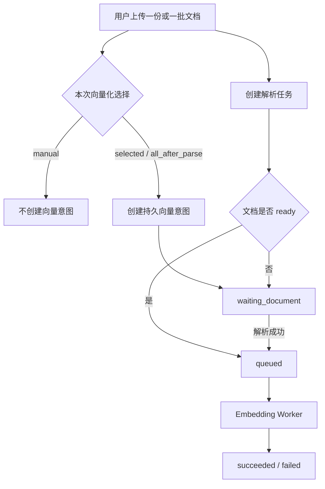

# 文档向量化、在线编辑、并发与缓存设计复盘

> 状态：2026-08-19 部分落地。后端提交 `c4696bc` 已交付等待意图、幂等申请、批量申请、取消和解析成功激活；
> 内容 revision、原文件读取、任务按 document 恢复、配额、Worker 租约和 Redis 仍标记为“计划中”。当前接口仍以
> [HTTP API 总览](../api/http-api-overview.md) 为准。

## 1. 本次讨论解决的问题

本次架构复盘围绕四个相互关联的问题展开：

1. 文档解析完成后是否必须自动向量化；
2. 用户选择单份、选中多份或本批次全部向量化时，任务状态如何设计；
3. PDF 打开、Markdown 编辑、草稿恢复和重新向量化之间如何保持版本一致；
4. 高并发和多实例阶段什么时候需要 PostgreSQL 并发控制、浏览器缓存与 Redis。

最终方向是：继续保持模块化单体和 PostgreSQL 任务队列，把“解析完成”和“希望向量化”作为两个独立事实；
先解决幂等、状态机、版本和背压，再按实际指标引入 Redis，不提前拆微服务。

## 2. 当前事实与计划能力

| 能力 | 当前事实 | 本次确认的演进方向 |
| --- | --- | --- |
| 文档上传 | 单文件接口；前端已用有限并发编排批量上传 | 批次可以选择不向量化、选中向量化或全部向量化 |
| 文档解析 | 显式创建 `document_jobs`，解析状态与文档状态分离 | 保持独立，不把向量调用写死在 PDF Worker 中 |
| 向量化 | 单份/批量持久申请；未 ready 时进入 `waiting_document`；解析成功后激活 | 前端接入选择方式；后续增加按 document 恢复和 revision |
| 并发领取 | PostgreSQL `FOR UPDATE SKIP LOCKED` | 继续作为单库多 Worker 的领取机制 |
| PDF/MD 查看 | 当前前端主要浏览元数据和 chunks | 增加受保护内容读取、PDF Range/ETag 和 Markdown 编辑版本 |
| 缓存 | 浏览器和服务端尚无统一文档缓存方案 | 第一阶段使用编辑器内存、IndexedDB 草稿和私有 HTTP 缓存 |
| Redis | 当前没有依赖；限流为单实例进程内实现 | 多实例共享限流优先，其次 Session 缓存和任务进度通知 |

## 3. 核心业务决策：用户拥有向量化选择权

解析的目标是获得可浏览、可检索的文本；向量化会产生模型调用、Token、等待时间和费用。两者不应默认绑定。

产品层支持三种选择：

- `manual`：只上传和解析，不自动创建向量任务；
- `selected`：用户对选中文档批量申请向量化；
- `all_after_parse`：本次成功上传的全部文档在解析条件满足后向量化。

以后可以增加账户默认偏好，但“用户当前偏好”和“某份文档当时的决定”必须分开。修改默认值不能追溯改变历史文档。



## 4. 两套状态机必须独立

文档解析状态继续保持：

```text
uploaded → processing → ready
                     ↘ failed
failed   → processing（显式重试）
```

当前正式向量任务状态为：

```text
waiting_document → queued → processing → succeeded
        │             │          ↘ failed
        └→ canceled   └→ canceled
```

- `waiting_document` 表示用户意图已经持久化，但解析前置条件尚未满足；
- `queued` 只表示任务已经具备领取条件；
- 第一版只允许取消 `waiting_document` 和 `queued`；
- `processing` 是否支持协作式取消以后单独设计，不能通过杀进程冒充取消；
- 前端不得把 `ready` 解释成“向量已就绪”，也不得把 job `succeeded` 自行伪造成文档状态。

显式区分等待解析和等待 Worker，可以避免大量未解析任务污染真实队列等待时间，也便于建立准确指标。

## 5. PostgreSQL 是并发状态的唯一裁判

当前阶段不使用 Go 进程内互斥锁保护业务状态，也不使用 Redis 分布式锁替代数据库约束。即使只有两个请求，
也必须正确处理以下竞态：

| 并发场景 | 一致性规则 |
| --- | --- |
| 重复点击、网络重试、批量重复 ID | 活动任务部分唯一索引；接口幂等返回已有状态 |
| 解析完成与申请向量化同时发生 | 两个事务按相同顺序锁定 document 行；不会遗留错误等待状态 |
| 多 Worker 同时领取 | `FOR UPDATE SKIP LOCKED`；领取与改为 processing 同一事务 |
| 用户取消与 Worker 领取同时发生 | `UPDATE ... WHERE status IN (...)`；先成功的一方获得状态转换权 |
| 重新解析与向量写回同时发生 | 第一版禁止冲突操作；后续用 `content_revision/chunk_revision` 校验 |
| 删除与活动任务同时发生 | 后端冻结拒绝或级联语义，不能只依赖前端禁用按钮 |
| 单用户提交巨大批次 | 单批上限、单用户活动任务配额和全局 Worker 并发上限 |

批量向量化使用 OwnerScope 保护的 `POST /embedding-jobs/batch`。请求只提交文档 ID，不提交 `user_id`；SQL 在当前
owner 范围内选择和写入，越权资源按不存在处理。单次上限冻结为 100 份文档，输入去重并按首次出现顺序逐项返回。
每份文件使用独立短事务，一项失败不会回滚其他文件已经创建或复用的任务。

## 6. 高并发演进顺序

当前最适合的是“可控并发的模块化单体”，而不是立刻拆微服务：

```text
压测与指标
  → 数据库连接池配置化
  → 上传、问答、PDF、Embedding 有界并发
  → 单用户配额和系统背压
  → Worker 租约与过期恢复
  → API/Worker 分进程部署
  → 共享存储与多实例
  → Redis 和近似向量索引（有指标后）
```

需要特别注意：当前 `SKIP LOCKED` 已支持多个消费者安全领取，但启动恢复逻辑仍带有单实例假设。多实例前必须
增加 `worker_id`、`lease_expires_at` 和可选心跳，只恢复租约已过期的任务，不能在任意实例启动时重置全部
`processing` 任务。

## 7. PDF 与 Markdown 编辑的数据边界

不得直接把 `text_chunks` 当作在线编辑器的正式内容。chunks 和 embeddings 都是可重新生成的派生数据：

```text
原始 PDF / Markdown 当前版本
        ↓
document revision
        ↓
解析文本与 chunks
        ↓
embeddings（绑定 revision）
```

PDF 能力分三类：

- 打开原文件：受 OwnerScope 保护，支持流式读取、Range、ETag 和私有缓存；
- 批注、划线、评论：单独保存 annotation，不因纯批注自动使文本向量失效；
- 修改正文：保存为新 revision，不能原地覆盖唯一原件；必要时生成可编辑 Markdown 派生版本。

Markdown 保存采用乐观并发：客户端提交 `base_revision` 或 `If-Match`；数据库只在当前 revision 匹配时更新并递增。
版本不匹配返回稳定冲突，让前端加载最新版本、比较或合并，不能静默覆盖。

每次正式内容版本变化后：

1. 新 revision 成为正式内容；
2. 旧 chunks/embeddings 被标记为 stale 或不再视为当前版本；
3. 手动模式等待用户重新解析/向量化；
4. 自动模式创建绑定新 revision 的任务；
5. Worker 写回前再次核对任务 revision，过期结果不得覆盖新内容。

## 8. 缓存分层与 Redis 边界

“缓存”“草稿”和“正式数据”必须区分：

| 层次 | 用途 | 当前决策 |
| --- | --- | --- |
| 编辑器内存 | 输入、光标、撤销/重做 | 前端必需，页面关闭即失效 |
| IndexedDB | 崩溃、刷新后的本地草稿恢复 | 建议；键包含 user、document、base revision |
| HTTP 缓存 | PDF/MD 内容重复打开 | `ETag` + `Cache-Control: private`；敏感场景可 `no-store` |
| 前端请求缓存 | 文档详情、任务状态和列表 | 保存成功后按查询键失效或更新 |
| Redis | 跨实例短期状态和性能加速 | 暂不作为当前依赖，按下列顺序后置 |

Redis 计划顺序：

1. 多 API 实例共享限流，保护登录、验证码、上传、问答和向量任务；
2. PostgreSQL Session 查询成为已测量瓶颈后增加 Cache-Aside；
3. API 与 Worker 分离后用 Pub/Sub 通知任务进度，PostgreSQL仍保存最终状态；
4. 只有 PostgreSQL 任务队列出现可观测瓶颈后，才评估 Redis Streams 或专用消息队列。

Redis 故障降级必须提前冻结：限流回退进程内应急限制；Session 缓存回源 PostgreSQL且绝不能绕过鉴权；
进度通知失败时前端退回轮询。PDF、Markdown 正式内容、唯一草稿、chunks、vectors、权限和计费账本不放在
Redis 中作为唯一数据源。

## 9. 已交付与计划中的跨端契约

下表明确区分当前可调用接口和候选方向：

| 能力 | 接口或字段 | 状态 | 关键语义 |
| --- | --- | --- | --- |
| 单份申请向量化 | `POST /documents/:id/embeddings` | 已交付 | 首次 `202`；活动任务幂等返回 `200` |
| 批量申请向量化 | `POST /embedding-jobs/batch` | 已交付 | OwnerScope、最多 100 项、去重、逐项结果 |
| 查询向量任务 | `GET /embedding-jobs/:id` | 已交付 | 只能查询当前用户文档关联任务 |
| 取消待执行任务 | `POST /embedding-jobs/:id/cancel` | 已交付 | waiting/queued 可取消；processing/终态返回 `409` |
| 按文档恢复向量任务 | 待冻结 | 计划中 | 刷新后恢复 waiting/queued/processing，而不是猜 job ID |
| 读取原始内容 | `GET /documents/:id/content` | 计划中 | OwnerScope、Range、ETag、私有缓存 |
| 保存 Markdown | `PUT /documents/:id/content` | 计划中 | base revision、冲突响应、新 revision |
| PDF annotation | 待冻结 | 计划中 | 独立版本，不直接改写原 PDF |
| 用户默认向量偏好 | 待冻结 | 计划中 | 只影响以后创建的文档，不追溯历史记录 |

## 10. 跨端完成标准

- 用户可以清楚选择“不向量化、选中向量化、本批次全部向量化”；
- 刷新后仍能从后端恢复真实向量任务，不依赖页面内临时 job ID；
- 重复请求和多标签页操作不会创建多条活动任务；
- 取消、领取、解析完成、重新解析和删除的竞态都有服务端测试；
- Markdown 多标签页保存不会静默覆盖，PDF 私有内容不会进入公共缓存；
- 内容 revision、chunks revision 和 embedding revision 不会错配；
- 单用户不能通过大批量或高频模型请求占满全局资源；
- Redis 未部署或临时不可用时，鉴权、最终任务状态和正式数据仍然正确。

具体开发清单分别见：

- [前端交接：用户可选向量化与文档编辑](../../frontend/architecture/document-vectorization-editing-handoff.md)
- [后端交接：向量任务并发、版本与 Redis 演进](../../backend/architecture/document-vectorization-concurrency-handoff.md)
- [文档处理并发与 Python 进程复用交接](document-processing-concurrency-review.md)
