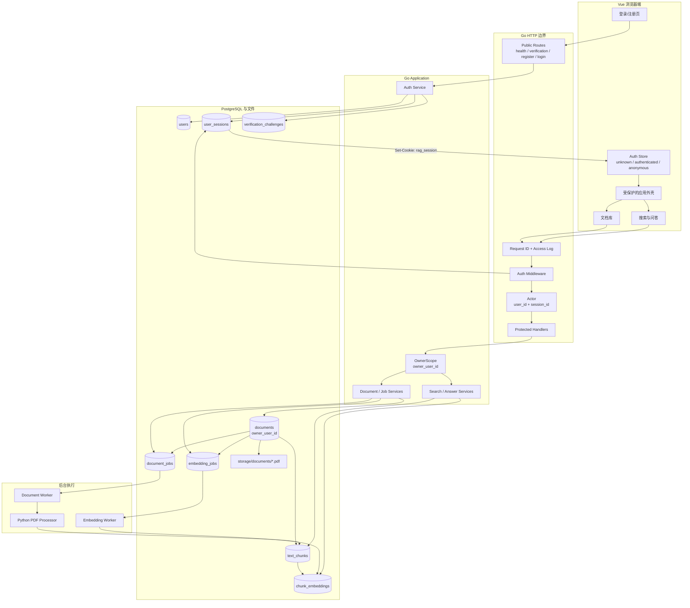
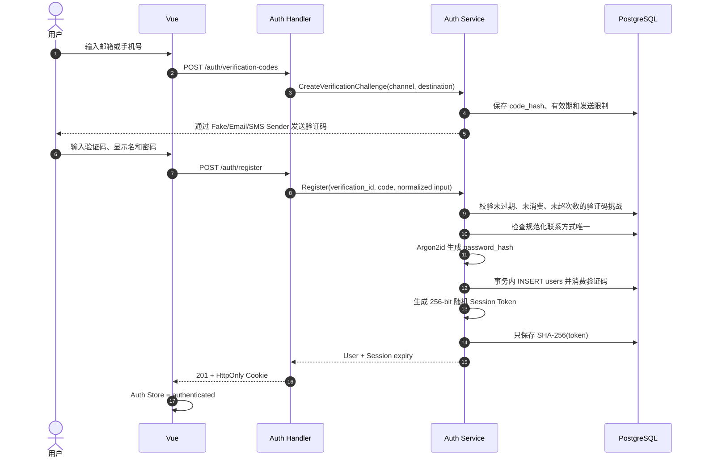
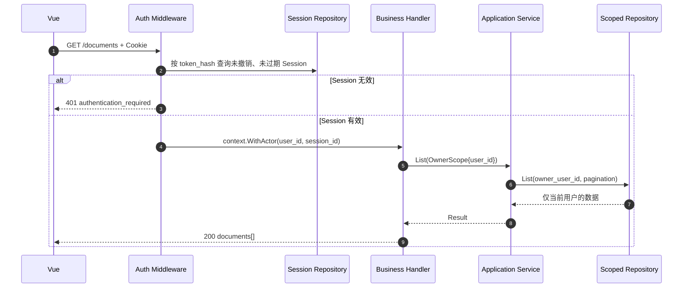
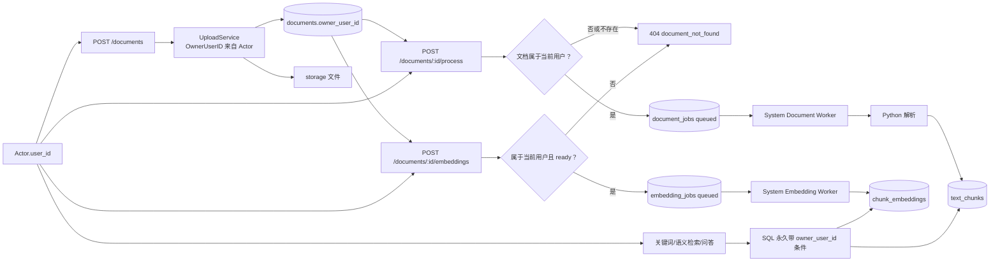
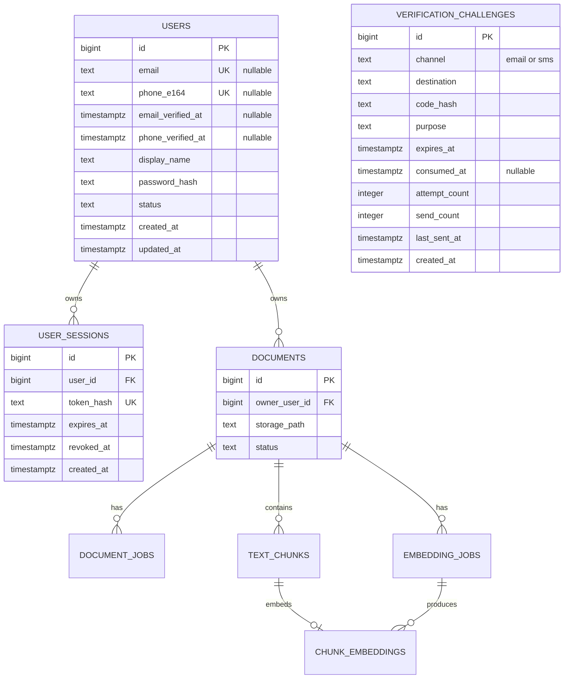

# P6 个人用户域与私有数据闭环

> 状态：后端 B1～B7 已完成。身份闭环和全部用户业务能力已接入 Cookie、OwnerScope 与作用域 SQL；本地 Mailpit 注册、历史数据受控认领、`owner_user_id NOT NULL` 及发布验收均已通过。下一步完成前端个人用户产品闭环。确认日期：2026-08-17。
> 本文是前端、后端、数据库与部署共同遵守的 P6 范围基线；团队工作区、成员角色和真正的多租户属于后续 P7。

## 1. 本阶段要解决的问题

P6 改造前，系统虽然拥有完整的文档与 RAG 后端能力，但所有请求共享同一组数据。P6 已将它封装成不同个人用户可以安全使用的
小型软件，每个用户只拥有自己的文档、任务、文本块、向量和检索证据。

本阶段完成后，用户主流程是：

```text
注册或登录
  → 上传自己的文档
  → 创建并观察解析任务
  → 创建并观察向量任务
  → 在自己的文档范围内搜索和问答
  → 删除自己的文档
  → 退出登录
```

P6 不实现：

- 团队工作区、邀请、共享文档、管理员/成员角色；
- 企业 SSO、OAuth、MFA 和找回密码；
- 商业计费和复杂套餐；
- Redis、分布式 Session 或多实例限流；
- 在同一阶段迁移全部接口到新的 API 版本前缀。

## 2. 已冻结的核心决策

| 主题 | P6 决策 | 原因 |
| --- | --- | --- |
| 隔离模型 | 每份文档绑定一个 `owner_user_id` | 满足个人私有数据，不提前引入 Workspace |
| 认证方式 | 服务端不透明 Session + `HttpOnly` Cookie | 浏览器不保存长期 Bearer Token，支持主动失效 |
| Session 存储 | PostgreSQL | 当前单实例规模足够，Redis 后置 |
| 密码存储 | Argon2id 编码哈希，只保存哈希 | 不保存、记录或回传明文密码 |
| 注册凭据 | 已验证邮箱或已验证手机号二选一 | 保证账户至少拥有一个可验证、可唯一识别的联系方式 |
| 验证方式 | 统一验证码挑战模型；首版以零成本 Fake Sender 和邮箱链路为主 | 先验证业务闭环，再按需接入收费短信服务 |
| 密码规则 | 8–128 个 ASCII 字符，只允许字母和数字，且至少包含大写、小写和数字 | 当前产品规则；后端是最终校验边界，前端只做体验提示 |
| 身份来源 | 后端认证中间件生成 `Actor` | 不接受请求体或查询参数中的 `user_id` |
| 越权响应 | 资源不存在和不属于当前用户统一返回 `404` | 避免通过数字 ID 枚举其他用户资源 |
| 业务路径 | 保持现有 `/documents`、`/search`、`/answers` 等路径 | 不把身份接入和 API 版本迁移混成一个高风险变更 |
| 文件布局 | P6 不移动现有物理文件 | 文件路径不公开；本期通过数据库和服务端查询实现隔离 |
| 缓存 | 不作为 P6 前置条件 | 先建立正确归属和一致性，再依据负载局部接入 |

## 3. 细化后的产品主线图



图中的关键边界是：浏览器只携带 Cookie；`user_id` 只能由 Auth Middleware 从有效 Session 中恢复；
所有面向用户的 Application/Repository 查询必须使用该身份形成 `OwnerScope`。Worker 是系统内部执行者，
可以领取全局任务，但只能根据任务关联的文档读取文件和写入派生数据。

## 4. 注册、登录与受保护请求时序

### 4.1 验证联系方式、注册与建立 Session



登录使用邮箱或手机号作为 `identifier`，并复用相同的 Session 创建过程。错误响应必须对“联系方式不存在”、
“密码错误”和“账户不可登录”使用同一个 `invalid_credentials`，避免账号枚举。

验证码基线：6 位数字、10 分钟有效、最多验证 5 次、60 秒后允许重发、成功后只能消费一次。数据库不保存
明文验证码，而保存带服务端密钥的 HMAC-SHA-256；仅做普通 SHA-256 会让攻击者很容易枚举全部 100 万种
六位验证码。发送接口必须按联系方式、IP 和全局预算限流，避免验证码轰炸和短信费用失控。

### 4.2 受保护业务请求



## 5. 带用户隔离的文档与 RAG 主链



数据隔离不在前端完成，也不能只在 Handler 查询后过滤。关键词检索、语义检索和问答是最高风险入口，
因为它们可能在一次请求中扫描多份文档，必须在 SQL 候选集合阶段限定 `owner_user_id`。

## 6. 数据模型



`document_jobs`、`text_chunks`、`embedding_jobs` 和 `chunk_embeddings` 不在 P6 重复保存 `user_id`；它们通过
不可变的 `document_id` 归属文档。面向用户查询任务或 chunks 时必须 JOIN/先验证所属文档，不能仅凭任务 ID 返回。

## 7. HTTP 认证契约摘要

当前已经实现：

| 方法 | 路径 | 身份要求 | 成功结果 |
| --- | --- | --- | --- |
| `POST` | `/auth/verification-codes` | 公开、严格限流和 Origin 校验 | `202`，返回挑战 ID、过期和重发时间 |
| `POST` | `/auth/register` | 公开、受限流和 Origin 校验 | `201`，创建用户和 Session，设置 Cookie |
| `POST` | `/auth/login` | 公开、受限流和 Origin 校验 | `200`，创建 Session，设置 Cookie |
| `POST` | `/auth/password-reset` | 公开、受限流和 Origin 校验 | `204`，更新密码、撤销全部旧 Session 并清除 Cookie |
| `POST` | `/auth/logout` | Session 可选、必须同源 | `204`，存在时撤销 Session，并始终清除 Cookie |
| `GET` | `/users/me` | 已登录 | `200`，返回当前用户公开信息 |

当前验证码用途支持 `register` 和 `password_reset`，两种 HMAC 摘要和消费流程严格隔离，不能把注册验证码
复用成重置密码凭证。密码重置在一个 PostgreSQL 事务中更新 Argon2id 哈希、消费挑战并撤销全部旧 Session；
成功后清除当前 Cookie、返回 `204`，用户必须使用新密码重新登录。没有匹配账户时统一返回验证码无效，避免
通过重置接口枚举账户。

`GET /health` 保持公开。`POST /auth/logout` 使用可选身份以保证重复退出仍返回 `204`；`GET /users/me` 和
当前全部文档、任务、搜索、语义检索和问答接口都变为受保护接口。注册只引用服务端保存的验证码挑战，
不信任客户端自行声明“已验证”；业务请求体永远不增加可由客户端填写的 `user_id`。

验证码发送端口统一为 `VerificationSender`，Application 只依赖该契约：

```text
Application → VerificationSender ← FakeVerificationSender
                                 ← EmailVerificationSender
                                 ← AliyunSMSVerificationSender（后续按需接入）
```

默认开发和自动化测试使用 Fake Sender，不产生远程费用；本地人工邮件联调可使用 Mailpit。真实邮件服务可以在
独立验收时启用，短信提供商在确认实名、签名、模板和预算后再接入，不能成为默认回归依赖。

Cookie 基线：

```text
Name     = rag_session
HttpOnly = true
SameSite = Lax
Path     = /
Secure   = 生产环境 true，本地 HTTP 开发 false
```

使用 Cookie 认证后，所有改变状态的请求必须校验同源 `Origin`；生产 CORS 不允许在携带凭据时使用通配来源。

## 8. 个人用户隔离矩阵

| 能力 | 当前风险 | P6 后端约束 |
| --- | --- | --- |
| 上传 | 已完成基础隔离 | 从 Actor 写入 `documents.owner_user_id` |
| 文档列表/详情 | 已完成基础隔离 | 所有查询带 OwnerScope |
| 删除 | 已完成基础隔离 | 只删除当前用户文档，不属于时返回 404 |
| 解析任务创建 | 已完成基础隔离 | 创建前按 OwnerScope 查文档，写入 SQL 再次限定 owner |
| 解析任务轮询 | 已完成基础隔离 | 任务 JOIN 文档并校验 owner |
| chunks 浏览 | 已完成基础隔离 | 文档归属和 ready 状态同时满足，分页 SQL 也限定 owner |
| 向量任务 | 已完成基础隔离 | 创建使用带 owner 条件的原子 SQL，轮询 JOIN 所属文档并限定 owner |
| 关键词检索 | 已完成基础隔离 | count/data SQL 候选集合均限定 owner |
| 语义检索 | 已完成基础隔离 | 就绪检查、可选文档过滤和相似度候选集都限定 owner |
| 问答 | 已完成基础隔离 | Answer Service 显式传递 Scope，只消费已隔离的语义检索结果 |

## 9. 历史数据迁移

项目升级前曾存在无归属文档，不能在一次自动迁移中猜测它们属于哪个未来账户，因此采用并已完成两次发布：

1. 创建 `users`、`user_sessions`、`verification_challenges`，并给 `documents` 增加暂时可空的 `owner_user_id`；
2. 新代码对空归属文档默认拒绝公开访问；
3. 管理者注册真实账户；
4. 使用一次性受控命令把历史文档显式认领给该账户，并输出认领数量；
5. 核对所有文档都已有归属；
6. 后续迁移把 `owner_user_id` 改为 `NOT NULL`。

B6 实际执行结果：正式个人用户通过 Mailpit 注册链路创建；`assign-document-owner` 先预览 46 篇无主文档，
再以 `-confirm -expected-unowned 46` 在一个事务中完成认领。提交后无主文档为 0，2729 个 chunks、45 个
解析任务、8 个向量任务和 460 条向量仍通过原 `document_id` 关系继承所有者。B7 已把这一运行事实
升级为数据库 `NOT NULL` 强约束，并通过一次性数据库迁移、真实 Go/Python 链路和双用户隔离发布验收。

禁止迁移脚本创建带固定密码的“默认用户”，也禁止将历史数据自动分配给第一个注册者。

## 10. 缓存与扩展边界

P6 不引入通用缓存层：

- Session 先存 PostgreSQL；
- 验证码发送、登录和注册限流先使用单实例内存实现；
- 文档和任务状态直接读取 PostgreSQL；
- Embedding 复用、Redis Session、分布式限流等只在真实负载出现后增加专用端口。

未来任何面向用户的缓存键必须包含用户或工作区作用域。缓存失效或 Redis 不可用时，PostgreSQL 仍是业务事实来源。

## 11. 完成标准

P6 只有同时满足以下条件才算闭环：

- 验证联系方式、注册、登录、刷新页面恢复登录态、退出均通过真实 HTTP 验收；
- 忘记密码使用独立用途验证码，重置成功后旧 Cookie 和旧密码失效，新密码可重新登录；
- 用户必须至少绑定一个已验证邮箱或手机号，验证码不可重复消费或暴力枚举；
- 密码和原始 Session Token 不进入数据库、日志或响应正文；
- 上传的文档可靠绑定当前用户；
- 用户 A 无法通过文档 ID、任务 ID、搜索、语义检索或问答发现用户 B 的数据；
- 未登录业务请求统一返回带稳定错误码的 `401`；
- 历史文档完成显式归属且 `owner_user_id` 最终为 `NOT NULL`；
- 前端不提交 `user_id`，所有身份来自 Cookie；
- 默认回归不需要真实远程模型费用，并包含双用户越权测试；
- 文档明确区分已实现能力和仍在计划中的 P7 团队能力。

## 12. P7 预留但不提前实现

未来出现共享知识库需求后，再引入：

```text
workspaces
workspace_memberships
roles / permissions
documents.workspace_id
workspace-scoped quotas and audit
```

P6 的 `Actor`、认证中间件和受作用域约束的 Repository 可以继续复用；届时将 `OwnerScope` 演进为
`WorkspaceScope`，而不是在 P6 先写入没有真实语义的固定 `tenant_id`。
